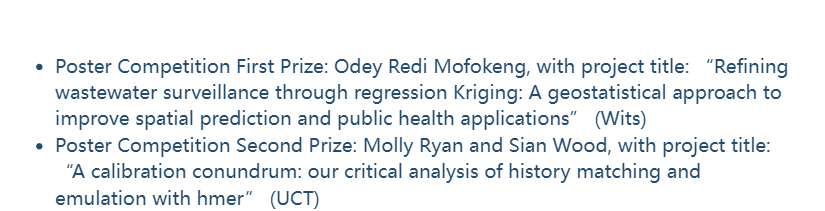

```{=html}
<!-- ====== PROJECTS PAGE INTRO ====== -->
<section class="page-section reveal">
<div class="container">

<div class="section-header">
<h2>Research & Analytical Projects</h2>
<p>A collection of my research, coursework, and competitive analysis projects — each demonstrating applied statistical thinking and technical execution in R.</p>
</div>

<!-- ============================================================ -->
<!-- PROJECT 1: Regression Kriging                                 -->
<!-- ============================================================ -->
<div id="regression-kriging" class="mb-5" style="scroll-margin-top: 5rem;">
<div style="background: var(--om-warm-white); border: 1px solid rgba(201,149,93,.1); border-radius: var(--om-radius-lg); overflow: hidden;">

<div style="height: 6px; background: linear-gradient(135deg, #B85C38, #D4856A);"></div>

<div class="row g-0">
<!-- Left: Details -->
<div class="col-lg-7 p-4 p-lg-5">
<div class="d-flex flex-wrap gap-2 align-items-center mb-3">
<span class="card-tag" style="background: rgba(184,92,56,.1); color: var(--om-primary);">Spatial Statistics</span>
<span class="card-tag" style="background: rgba(212,168,83,.1); color: #A0842E;"><i class="fas fa-trophy me-1"></i>1st Prize — SASA 2025</span>
<span class="card-tag" style="background: rgba(92,154,79,.1); color: #3D6B30;">84% — Top Project</span>
</div>

<h3 style="font-family: var(--om-font-heading); font-size: 1.6rem; font-weight: 800;">
Regression Kriging for Wastewater Surveillance
</h3>

<p style="color: #5C3D2E; line-height: 1.8; margin-top: 1rem;">
This research project developed advanced spatial statistical models to analyse wastewater surveillance
data across monitoring stations. The study compared regression-kriging approaches against standard
ordinary kriging methods, using rigorous diagnostic metrics including RMSE, MAE, and cross-validated
R-squared to evaluate predictive performance. Feature engineering incorporated demographic and
infrastructure covariates to improve spatial predictions beyond what pure geostatistical interpolation
could achieve.
</p>

<p style="color: #5C3D2E; line-height: 1.8;">
Scoring 84% — the top project in Mathematical Statistics Honours — the work was presented at the
South African Statistical Association (SASA) Annual Conference where it earned First Prize for Best
Poster. It also received the Peter Fridjhon Gold Medal for Best Honours Research Project in
Mathematical Statistics. The project demonstrated proficiency in the full spatial modelling pipeline:
data preprocessing, exploratory spatial data analysis, variogram modelling, kriging interpolation,
and spatial cross-validation using the R packages gstat, sp, and caret.
</p>

<div class="d-flex flex-wrap gap-2 mt-3">
<span class="skill-pill" style="padding: .3rem .75rem; border-radius: .375rem; font-size: .8rem; font-weight: 500; background: rgba(201,149,93,.1); color: #8B6D3F; border: 1px solid rgba(201,149,93,.12);">R</span>
<span class="skill-pill" style="padding: .3rem .75rem; border-radius: .375rem; font-size: .8rem; font-weight: 500; background: rgba(201,149,93,.1); color: #8B6D3F; border: 1px solid rgba(201,149,93,.12);">Geostatistics</span>
<span class="skill-pill" style="padding: .3rem .75rem; border-radius: .375rem; font-size: .8rem; font-weight: 500; background: rgba(201,149,93,.1); color: #8B6D3F; border: 1px solid rgba(201,149,93,.12);">gstat</span>
<span class="skill-pill" style="padding: .3rem .75rem; border-radius: .375rem; font-size: .8rem; font-weight: 500; background: rgba(201,149,93,.1); color: #8B6D3F; border: 1px solid rgba(201,149,93,.12);">Spatial CV</span>
<span class="skill-pill" style="padding: .3rem .75rem; border-radius: .375rem; font-size: .8rem; font-weight: 500; background: rgba(201,149,93,.1); color: #8B6D3F; border: 1px solid rgba(201,149,93,.12);">Regression Kriging</span>
</div>
</div>

<!-- Right: Files & Images -->
<div class="col-lg-5 p-4 p-lg-5" style="background: rgba(201,149,93,.03); border-left: 1px solid rgba(201,149,93,.08);">
<h5 style="font-family: var(--om-font-body); font-weight: 700; margin-bottom: 1rem;">
<i class="fas fa-folder-open me-2" style="color: var(--om-primary);"></i>Project Files
</h5>

<!-- PDF Viewer: Poster -->
<div class="pdf-viewer mb-3">
<div class="pdf-viewer-header">
<div class="pdf-title"><i class="fas fa-file-pdf"></i> Research Poster</div>
<a href="assets/kriging/Wastewater_Modelling_Poster_Odey_Mofokeng.pdf" download class="pdf-download"><i class="fas fa-download"></i> Download</a>
</div>
<iframe src="assets/kriging/Wastewater_Modelling_Poster_Odey_Mofokeng.pdf" title="Research Poster"></iframe>
</div>

<!-- Image Gallery -->
<div class="gallery-grid" style="grid-template-columns: 1fr 1fr; gap: .75rem;">
<div class="gallery-item">

<div class="gallery-caption">Kriging Map</div>
</div>
<div class="gallery-item">

<div class="gallery-caption">Variogram</div>
</div>
</div>

</div>
</div>

</div>
</div>

<!-- ============================================================ -->
<!-- PROJECT 2: ASA DataFest                                       -->
<!-- ============================================================ -->
<div id="asa-datafest" class="mb-5" style="scroll-margin-top: 5rem;">
<div style="background: var(--om-warm-white); border: 1px solid rgba(201,149,93,.1); border-radius: var(--om-radius-lg); overflow: hidden;">
<div style="height: 6px; background: linear-gradient(135deg, #8B5E3C, #C9955D);"></div>

<div class="row g-0">
<div class="col-lg-7 p-4 p-lg-5">
<div class="d-flex flex-wrap gap-2 align-items-center mb-3">
<span class="card-tag" style="background: rgba(139,94,60,.1); color: #8B5E3C;">Data Competition</span>
<span class="card-tag" style="background: rgba(184,92,56,.1); color: var(--om-primary);">Facilitator 2026</span>
</div>

<h3 style="font-family: var(--om-font-heading); font-size: 1.6rem; font-weight: 800;">
ASA DataFest 2025 & Facilitator 2026
</h3>

<p style="color: #5C3D2E; line-height: 1.8; margin-top: 1rem;">
Participated in the American Statistical Association (ASA) DataFest 2025, a premier data analysis
competition where teams work intensively over a weekend to extract meaningful insights from large,
complex real-world datasets. The competition format demands rapid analytical thinking, effective
teamwork, and the ability to present findings clearly under tight time constraints to panels of
academic and industry judges.
</p>

<p style="color: #5C3D2E; line-height: 1.8;">
Based on strong performance in the 2025 competition, I was selected as a Facilitator for ASA
DataFest 2026, where I mentor participating teams and guide data analysis workflows. This role
involves supporting students through the analytical process, helping them navigate methodological
choices, and fostering collaborative problem-solving — skills that directly complement my tutoring
experience in Mathematical Statistics at Wits.
</p>

<div class="d-flex flex-wrap gap-2 mt-3">
<span class="skill-pill" style="padding: .3rem .75rem; border-radius: .375rem; font-size: .8rem; font-weight: 500; background: rgba(201,149,93,.1); color: #8B6D3F; border: 1px solid rgba(201,149,93,.12);">Team Collaboration</span>
<span class="skill-pill" style="padding: .3rem .75rem; border-radius: .375rem; font-size: .8rem; font-weight: 500; background: rgba(201,149,93,.1); color: #8B6D3F; border: 1px solid rgba(201,149,93,.12);">EDA</span>
<span class="skill-pill" style="padding: .3rem .75rem; border-radius: .375rem; font-size: .8rem; font-weight: 500; background: rgba(201,149,93,.1); color: #8B6D3F; border: 1px solid rgba(201,149,93,.12);">Statistical Modelling</span>
<span class="skill-pill" style="padding: .3rem .75rem; border-radius: .375rem; font-size: .8rem; font-weight: 500; background: rgba(201,149,93,.1); color: #8B6D3F; border: 1px solid rgba(201,149,93,.12);">Data Visualization</span>
<span class="skill-pill" style="padding: .3rem .75rem; border-radius: .375rem; font-size: .8rem; font-weight: 500; background: rgba(201,149,93,.1); color: #8B6D3F; border: 1px solid rgba(201,149,93,.12);">Mentoring</span>
</div>
</div>

<div class="col-lg-5 p-4 p-lg-5" style="background: rgba(201,149,93,.03); border-left: 1px solid rgba(201,149,93,.08);">
<h5 style="font-family: var(--om-font-body); font-weight: 700; margin-bottom: 1rem;">
<i class="fas fa-folder-open me-2" style="color: #8B5E3C;"></i>Event Photos & Article
</h5>

<!-- PDF Viewer: Article -->
<div class="pdf-viewer mb-3">
<div class="pdf-viewer-header">
<div class="pdf-title"><i class="fas fa-file-pdf"></i> ASA Article</div>
<a href="assets/datafest/SEPTEMBER25_wordpress_ASA Article.pdf" download class="pdf-download"><i class="fas fa-download"></i> Download</a>
</div>
<iframe src="assets/datafest/SEPTEMBER25_wordpress_ASA Article.pdf" title="ASA DataFest Article"></iframe>
</div>

<!-- Image Gallery -->
<div class="gallery-grid" style="grid-template-columns: 1fr 1fr; gap: .75rem;">
<div class="gallery-item">

<div class="gallery-caption">Day 1</div>
</div>
<div class="gallery-item">

<div class="gallery-caption">Group Photo</div>
</div>
</div>

</div>
</div>

</div>
</div>

<!-- ============================================================ -->
<!-- PROJECT 3: Reliability Analysis                               -->
<!-- ============================================================ -->
<div id="reliability-analysis" class="mb-5" style="scroll-margin-top: 5rem;">
<div style="background: var(--om-warm-white); border: 1px solid rgba(201,149,93,.1); border-radius: var(--om-radius-lg); overflow: hidden;">
<div style="height: 6px; background: linear-gradient(135deg, #5C7A4F, #8BA879);"></div>

<div class="p-4 p-lg-5">
<div class="d-flex flex-wrap gap-2 align-items-center mb-3">
<span class="card-tag" style="background: rgba(92,122,79,.1); color: #5C7A4F;">Survival Analysis</span>
<span class="card-tag" style="background: rgba(148,163,184,.1); color: #8B7355;">Coursework</span>
</div>

<h3 style="font-family: var(--om-font-heading); font-size: 1.6rem; font-weight: 800;">
Statistical Elements of Reliability Analysis
</h3>

<p style="color: #5C3D2E; line-height: 1.8; margin-top: 1rem;">
An in-depth mini-project focusing on the statistical foundations of reliability analysis — the study of
how long systems and components operate before failure. The project explored lifetime data modelling
and failure time analysis using a range of survival analysis techniques, including Kaplan-Meier estimation,
parametric survival models (Weibull, exponential, log-normal), and Cox proportional hazards regression.
</p>

<p style="color: #5C3D2E; line-height: 1.8;">
Key areas of investigation included the construction and interpretation of survival curves, the assessment
of proportional hazards assumptions, and the comparison of model fit using AIC and likelihood ratio tests.
The project applied these techniques to reliability datasets, demonstrating the practical application of
survival analysis methods in engineering and industrial contexts. The work reinforced core competencies
in lifetime data analysis and parametric inference that are directly transferable to actuarial survival
modelling and biostatistical applications.
</p>

<div class="d-flex flex-wrap gap-2 mt-3">
<span class="skill-pill" style="padding: .3rem .75rem; border-radius: .375rem; font-size: .8rem; font-weight: 500; background: rgba(201,149,93,.1); color: #8B6D3F; border: 1px solid rgba(201,149,93,.12);">Survival Analysis</span>
<span class="skill-pill" style="padding: .3rem .75rem; border-radius: .375rem; font-size: .8rem; font-weight: 500; background: rgba(201,149,93,.1); color: #8B6D3F; border: 1px solid rgba(201,149,93,.12);">Lifetime Data</span>
<span class="skill-pill" style="padding: .3rem .75rem; border-radius: .375rem; font-size: .8rem; font-weight: 500; background: rgba(201,149,93,.1); color: #8B6D3F; border: 1px solid rgba(201,149,93,.12);">R</span>
<span class="skill-pill" style="padding: .3rem .75rem; border-radius: .375rem; font-size: .8rem; font-weight: 500; background: rgba(201,149,93,.1); color: #8B6D3F; border: 1px solid rgba(201,149,93,.12);">Failure Modelling</span>
</div>
</div>
</div>
</div>

<!-- ============================================================ -->
<!-- PROJECT 4: Applied Sampling                                   -->
<!-- ============================================================ -->
<div id="applied-sampling" class="mb-5" style="scroll-margin-top: 5rem;">
<div style="background: var(--om-warm-white); border: 1px solid rgba(201,149,93,.1); border-radius: var(--om-radius-lg); overflow: hidden;">
<div style="height: 6px; background: linear-gradient(135deg, #A0522D, #CD853F);"></div>

<div class="row g-0">
<div class="col-lg-7 p-4 p-lg-5">
<div class="d-flex flex-wrap gap-2 align-items-center mb-3">
<span class="card-tag" style="background: rgba(160,82,45,.1); color: #A0522D;">Survey Design</span>
<span class="card-tag" style="background: rgba(212,168,83,.1); color: #A0842E;"><i class="fas fa-star me-1"></i>Top Performance</span>
</div>

<h3 style="font-family: var(--om-font-heading); font-size: 1.6rem; font-weight: 800;">
Applied Sampling Project — EV Adoption
</h3>

<p style="color: #5C3D2E; line-height: 1.8; margin-top: 1rem;">
A top-performing mini-project estimating electric vehicle adoption intentions among 10,000 urban residents
using stratified sampling methodology. The study achieved a 23.75% variance reduction over simple random
sampling with a design-adjusted estimate of 0.4024 (SE = 0.0234, 95% CI: 0.3574–0.4490). The project
demonstrated the practical advantages of stratified designs in reducing estimation variance while
maintaining cost efficiency.
</p>

<p style="color: #5C3D2E; line-height: 1.8;">
Key techniques implemented included cost-constrained allocation optimisation, post-stratification adjustment
for missing-at-random nonresponse, and Bayesian estimation using binomial logit models. Monte Carlo
simulation with 200 replications validated the design's precision and coverage properties, confirming
that the stratified approach delivered statistically reliable estimates under realistic nonresponse
scenarios.
</p>

<div class="d-flex flex-wrap gap-2 mt-3">
<span class="skill-pill" style="padding: .3rem .75rem; border-radius: .375rem; font-size: .8rem; font-weight: 500; background: rgba(201,149,93,.1); color: #8B6D3F; border: 1px solid rgba(201,149,93,.12);">Survey Design</span>
<span class="skill-pill" style="padding: .3rem .75rem; border-radius: .375rem; font-size: .8rem; font-weight: 500; background: rgba(201,149,93,.1); color: #8B6D3F; border: 1px solid rgba(201,149,93,.12);">Stratified Sampling</span>
<span class="skill-pill" style="padding: .3rem .75rem; border-radius: .375rem; font-size: .8rem; font-weight: 500; background: rgba(201,149,93,.1); color: #8B6D3F; border: 1px solid rgba(201,149,93,.12);">Bayesian Estimation</span>
<span class="skill-pill" style="padding: .3rem .75rem; border-radius: .375rem; font-size: .8rem; font-weight: 500; background: rgba(201,149,93,.1); color: #8B6D3F; border: 1px solid rgba(201,149,93,.12);">R</span>
</div>
</div>

<div class="col-lg-5 p-4 p-lg-5" style="background: rgba(201,149,93,.03); border-left: 1px solid rgba(201,149,93,.08);">
<h5 style="font-family: var(--om-font-body); font-weight: 700; margin-bottom: 1rem;">
<i class="fas fa-folder-open me-2" style="color: #A0522D;"></i>Project File
</h5>

<!-- PDF Viewer -->
<div class="pdf-viewer">
<div class="pdf-viewer-header">
<div class="pdf-title"><i class="fas fa-file-pdf"></i> Full Report</div>
<a href="assets/course_mini_projects/applied_sampling/Applied_Sampling_EV_Adoption_Report.pdf" download class="pdf-download"><i class="fas fa-download"></i> Download</a>
</div>
<iframe src="assets/course_mini_projects/applied_sampling/Applied_Sampling_EV_Adoption_Report.pdf" title="Applied Sampling Report"></iframe>
</div>

</div>
</div>

</div>
</div>

<!-- ============================================================ -->
<!-- PROJECT 5: Biostatistics                                      -->
<!-- ============================================================ -->
<div id="biostatistics" class="mb-5" style="scroll-margin-top: 5rem;">
<div style="background: var(--om-warm-white); border: 1px solid rgba(201,149,93,.1); border-radius: var(--om-radius-lg); overflow: hidden;">
<div style="height: 6px; background: linear-gradient(135deg, #6B705C, #A5A58D);"></div>

<div class="row g-0">
<div class="col-lg-7 p-4 p-lg-5">
<div class="d-flex flex-wrap gap-2 align-items-center mb-3">
<span class="card-tag" style="background: rgba(107,112,92,.1); color: #6B705C;">Health Data</span>
<span class="card-tag" style="background: rgba(148,163,184,.1); color: #8B7355;">Coursework</span>
</div>

<h3 style="font-family: var(--om-font-heading); font-size: 1.6rem; font-weight: 800;">
Biostatistics Application — Treatment-Dependent Censoring
</h3>

<p style="color: #5C3D2E; line-height: 1.8; margin-top: 1rem;">
Statistical analysis of health and biological data applying appropriate biostatistical methods to draw
meaningful conclusions. This project examined the impact of treatment-dependent censoring on survival
analysis, a critical issue in clinical trials where patients receiving different treatments may have
systematically different patterns of dropout and loss to follow-up.
</p>

<p style="color: #5C3D2E; line-height: 1.8;">
The analysis employed techniques to assess bias introduced by informative censoring and explored
adjustment methods including inverse probability of censoring weighting (IPCW) and sensitivity
analyses. By comparing naive survival estimates with censoring-adjusted estimates, the project
demonstrated the practical consequences of ignoring treatment-dependent censoring in medical studies
and provided a framework for robust inference under non-ignorable missingness mechanisms.
</p>

<div class="d-flex flex-wrap gap-2 mt-3">
<span class="skill-pill" style="padding: .3rem .75rem; border-radius: .375rem; font-size: .8rem; font-weight: 500; background: rgba(201,149,93,.1); color: #8B6D3F; border: 1px solid rgba(201,149,93,.12);">Biostatistics</span>
<span class="skill-pill" style="padding: .3rem .75rem; border-radius: .375rem; font-size: .8rem; font-weight: 500; background: rgba(201,149,93,.1); color: #8B6D3F; border: 1px solid rgba(201,149,93,.12);">Health Data</span>
<span class="skill-pill" style="padding: .3rem .75rem; border-radius: .375rem; font-size: .8rem; font-weight: 500; background: rgba(201,149,93,.1); color: #8B6D3F; border: 1px solid rgba(201,149,93,.12);">Survival Analysis</span>
<span class="skill-pill" style="padding: .3rem .75rem; border-radius: .375rem; font-size: .8rem; font-weight: 500; background: rgba(201,149,93,.1); color: #8B6D3F; border: 1px solid rgba(201,149,93,.12);">R</span>
</div>
</div>

<div class="col-lg-5 p-4 p-lg-5" style="background: rgba(201,149,93,.03); border-left: 1px solid rgba(201,149,93,.08);">
<h5 style="font-family: var(--om-font-body); font-weight: 700; margin-bottom: 1rem;">
<i class="fas fa-folder-open me-2" style="color: #6B705C;"></i>Project File
</h5>

<!-- PDF Viewer -->
<div class="pdf-viewer">
<div class="pdf-viewer-header">
<div class="pdf-title"><i class="fas fa-file-pdf"></i> Presentation Slides</div>
<a href="assets/course_mini_projects/biostatistics/biostatistics_mini_slides.pdf" download class="pdf-download"><i class="fas fa-download"></i> Download</a>
</div>
<iframe src="assets/course_mini_projects/biostatistics/biostatistics_mini_slides.pdf" title="Biostatistics Slides"></iframe>
</div>

</div>
</div>

</div>
</div>

</div>
</section>

```

